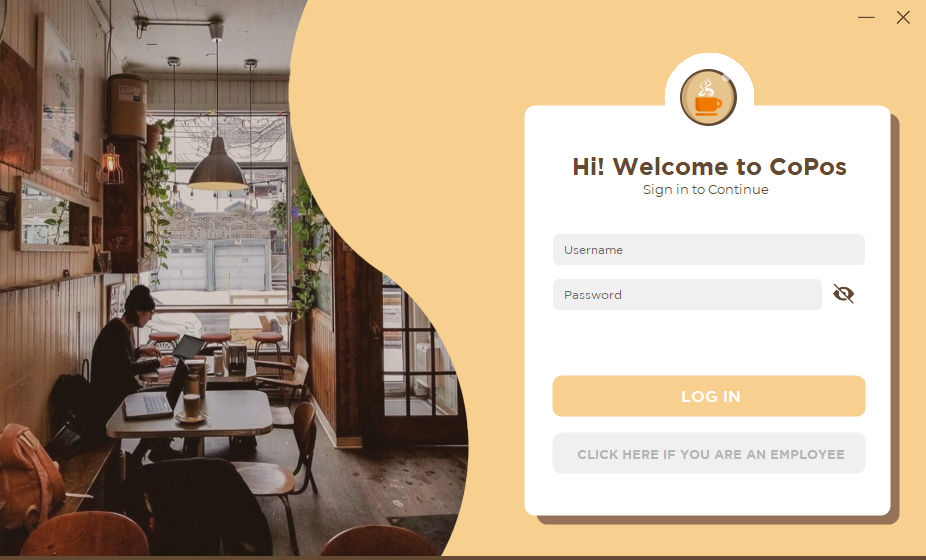

# Coffee Business Point of Sale and Purchase Inventory Management System

CoPOS is a simple system where it can provide easier capturing of data sales and inventory of a shop with data security which records the transaction of a certain user. The objective of CoPOS is to store large number of sales and inventory in long term purposes with data security that captures each transaction made by the user. User can do transaction for each customer in a few click that includes transaction recording.

## Features

## How to Setup
1. Clone the Project
2. Go to `Coffee\coposProject`
3. Copy `coposDb.accdb`, `CS201.Michael.Dumala-CoPos_3.pdf` and `image folder`
4. Paste those in `coposProject\bin\Debug`
5. Open `coposProject.sln` in Visual Studio and Run the project

## Contributers
- Michael Dumala
- Lenard Mangay Ayam
- Mark Neil Embile
- Brandell Bobby Reyes
- Geoffrey Biaco
- Mark Steven Lansangan
- Clarence James Orias

## Screen Shots

